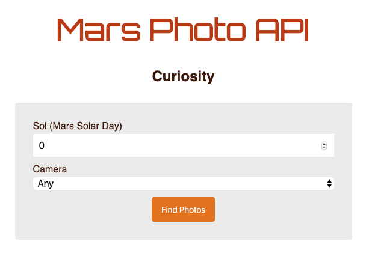

# Chingu Solo Project - Tier 3 - Mars Photos

## Overview ##

In this project you'll be creating an application that provides users with the ability to search for photos taken by NASA's Curiosity Mars rover. It will be a great project to show off your fullstack skills to peers and prospective employers.

You'll be responsible for coding the **HTML**, **CSS**, and **JavaScript** to get the structure, styling, and functionality up and running, as well as a back-end, in a stack of your choice, to process the necessary API call and, **if desired**, to allow user authentication and/or persistence functionality.

Ultimately you'll have a great portfolio piece, and will have implemented a number of common and in-demand features.

**You May Use the Stack of Your Choice!**

## About Chingu

If you aren’t yet a member of Chingu we invite you to join us. We help our 
members transform what they’ve learned in courses & tutorials into the 
practical experience employers need and want.

Our remote team projects let you refine your technical skills and put them 
into practice while gaining new “soft” skills like communication, 
collaboration, and Agile project management. The types of skills that 
help real-world teams get things done!

You can learn more and join us at [chingu.io](https://chingu.io).

## Instructions ##

Tier 3 **MUST** include a back-end to make the necessary API calls. If desired, you can also add authentication and/or persistence. Use of localStorage, IDB, CacheAPI, etc., are *not* fill-ins for this project's persistence if you choose to implement the Extra tasks.

General instructions for all Pre-Work Projects can also be found in the Chingu Voyage Handbook (URL posted in the #read-me-first channel on Discord).

**Requirements**

*Structure*
- [ ] Header containing the application title
- [ ] Search panel containing with subcomponents which allow the user to
select the Sol and Camera defining the group of photos to be displayed
- [ ] The search panel **must** contain a search button the user clicks to
display the photos
- [ ] Main section where the photos matching the search criteria will be displayed
- [ ] Footer section with your developer information

*Style*
- [ ] You may choose your own style for this app, but make sure your style choices
follow UI/UX best practices and are consistent throughout the app.
- [ ] Make your design fully responsive (small/large/portrait/landscape, etc.)

*Functionality*
- - The application must be architected with the following components:
    - [ ] A web frontend that accepts and validates search requests, obtains 
    results through an API implemented in the application backend, and displays 
    them to the user.
    - [ ] An application backend that implements an API with a single endpoint responsible for implementing the photo search by using the [Mars Rover Photos API](https://api.nasa.gov/api.html#SSC).
- [ ] Search for photos taken by the Curiosity rover based on the mission Sol (the mission day) and the rover camera that took the photo.
- [ ] When searching both the Sol and Camera must be specified by the user.
- [ ] Results are displayed when the user clicks the 'Find Photos' button. 
- [ ] Developers may implement any style they wish.
- [ ] The search feature should be fully functional and display matching photos

*Other*
- [ ] Your repo needs to have a robust README.md
- [ ] Make sure that there are no errors in the developer console before submitting
- [ ] Your API key **should not** be exposed in your frontend application or
in your public GitHub repo. Note that there are ways to protect application 
secrets without exposing them to the public.
- [ ] Handle edge cases like page loading and error messages from the API, not 
allowing API calls when query is empty, putting a timeout on a API call and 
providing user feedback if it expires, and ensuring that user input is valid.

**Extras (Not Required)**

- [ ] Implement a reset button to clear the search criteria and photo display area
- [ ] Implement the light/dark mode toggle buttons
- [ ] Implement the change display icon so you can flip between a grid layout 
and a list layout for the photos
- [ ] User creation and authentication: Add a login button to the page  
allowing registered users to login, or prompts new users to register. Once a 
user is authenticated, display that they are logged in in the heading.
- [ ] Add a favorites feature with back-end persistence: one example of this 
would be to use cookies to point to the user's favorite list in your database. 
You'll need to add a "see favorites" button somewhere to toggle between the 
view of the user's favorite photos and the searches that retrieved them.

## API Information ##

This project utilizes the [**Mars Rover Photos API**](https://api.nasa.gov/api.html#SSC). 
You will need to register for a [free api key](https://api.nasa.gov/index.html#apply-for-an-api-key) 
and you should take care not to expose your key in your GitHub repo.

The call to the **Mars Rover Photos API** needs to be completed in the 
backend. How you process that data is up to you.

## Example ##

